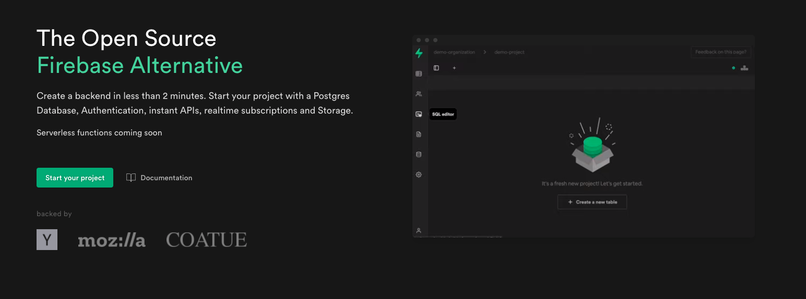

# ２．Supabase とは

Supabase とは、認証やデータベース、ストレージ等を提供する BaaS です。
類似サービスでは「Google Firebase」が存在します。今や Baas といえば、まず一番に思いつくサービスではないでしょうか。

実際に [Supabase の HP](https://supabase.com/)を開いてみると「The Open Source Firebase Alternative」と記載し、強く意識していることが分かります。

# Supabase vs Firebase

## 機能比較一覧表

FIrebase の基本的な機能は、Supabase にも存在します。

| -                |  Supabase  | Firebase |
| :--------------- | :--------: | :------: |
| 認証             |     ◯      |    ◯     |
| データベース     | PostgreSQL |  NoSQL   |
| ストレージ       |     ◯      |    ◯     |
| サーバーレス関数 |    △ ※1    |    ◯     |
| モバイル対応     |    △ ※2    |    ◯     |
| ホスティング     |   Ｘ ※3    |    ◯     |

※1 サーバレス関数は、現在ベータテストです。[(公式サイト)](https://supabase.com/blog/2021/07/30/supabase-functions-updates)

※2 モバイル対応は、Flatter のみライブラリが用意されています。REST API も用意されているので、他の言語でも開発は可能です。

※3 Firebase ホスティングのような、フロントをデプロイするためのサービスはありません。

## 無料プランの比較

無料プランの容量は、Firebase に分があります。

| -                      | Supabase(Free プラン) |  Firebase(Spark プラン)   |
| :--------------------- | :-------------------: | :-----------------------: |
| 認証                   |      10000 Users      |        10000 Users        |
| データベース           |         500MB         |            1GB            |
| データベース(転送容量) |          2GB          | Read 5 万回 / Write2 万回 |
| ストレージ             |          1GB          |            5GB            |

## 有料プランの比較

Supabase には２段階の料金プランが存在します。  
Pro プラン(定額 25 ドル/月)で以下の容量にアップされます。

| -                      | Supabase(Pro プラン) |
| :--------------------- | :------------------: |
| 認証                   |     100000 Users     |
| データベース           |         8GB          |
| データベース(転送容量) |         50GB         |
| ストレージ             |        100GB         |

Pay as you go プランは、Pro プラン(25 ドル)の容量で超えた分を従量課金で支払います。

| -            | Supabase(Pay as you go プラン) | Firebase(Blaze プラン) |
| :----------- | :----------------------------: | :--------------------: |
| 認証         |             無制限             |       $0.06/認証       |
| データベース |          $0.125 / GB           |      $0.108 / GB       |
| ストレージ   |          $0.021 / GB           |     $0.026/GB / GB     |

Firebase … 純粋に使用した分だけの金額  
Supabase … ２５ドル or ２５ドル＋使用した分だけの金額

これについては賛否両論あると思います。

従量課金制の場合、青天井で料金がかかってしまいます。
Supabase の Pro プランであれば、思いのほか料金がかかってしまったという事はありません。
そのため個人開発をする上では、安心感があるのではないかと思います。

また自動的に Pro as you go プランに変更されることも無く、事前に連絡がくるようです。

> If I exceed my limits, do I just get charged "Overage" for the items I use?  
> We have soft limits so we will reach out if you exceed resource limits on the Pro Tier. Your project plan will need to move to the Usage based pricing before we charge any usage pricing. We will work with you in advance to understand your project cost forecasts.[引用元](https://supabase.com/pricing)

## Supabase を利用するメリットはデータベースにある！

そんな絶対的な存在の Firebase ですが、
Supabase を使うメリットはデータベースにあります。

Firebase のデータベースは NoSQL ですが、 Supabase はリレーショナルデータベース(PostgreSQL)を採用しています。

RDB と NoSQL の違いについては、後で少しお話したいと思います。

まずは、実際に Supabase のプロジェクトを作ってみましょう！
