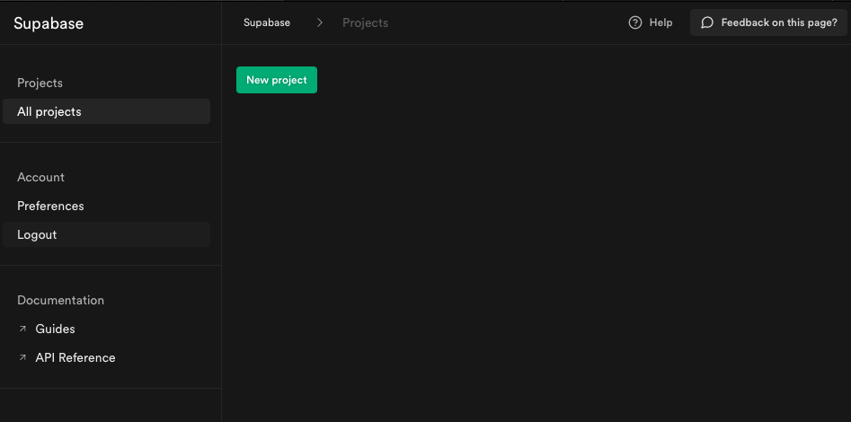

# ３．事前準備

## ✅ Supabase にサインアップ

Github アカウントを使って、Supabase にログインしましょう。

### ① [Supabase](https://supabase.com/)にアクセスする。

### ② [ Start your project ] をクリックする

### ③ [ Continue with GitHub ] をクリックする

### ④ Github のアカウント情報を入力後、[ Sign in ] を入力してください。

### ⑤ 以下のような画面が表示されれば成功です。

## ✅ Gitpod にサインアップ

開発環境の構築をしましょう。

### ① [ここをクリックして Gitpod を起動](https://gitpod.io/#https://github.com/AkiUnleash/hands-on-nextjs-supabase/tree/hands-on)

### ② 以下のような画面が表示されれば成功です。

## 🤔 RDB と NoSQL の違い

Gitpod の起動するまで時間がかかりますので、RDB と NoSQL の違いに簡単に説明します。

### RDB（リレーショナル型データベース）

テーブル（表）単位でデータを格納し管理します。複数のテーブルを結合して、複雑なデータ管理も可能です。

### メリット

#### データの一貫性が保証されている

システムエラー等で、データ登録時に正しく処理がされなかった場合でも、前の状態に戻ることが保証されています。

#### 複雑な操作（検索）が可能

テーブル通しで結合することで、色々なデータを作成できるので、追加削除のコストを下げられます。検索なども容易に可能です。

### NoSQL（ノーエスキューエル）

NoSQL の中にも色々な種類があるのですが、Firebase ではドキュメント指向データベースが採用されています。

Firebase Store には以下の３つの概念があります。

- コレクション
- ドキュメント
- フィールド

コレクション（フォルダ）の中に、ドキュメント（紙）が有り、その中にフィールド（データ）が記載しているイメージです。

### メリット

#### 高速な処理

他のプロセスと同期を取らずに、読み書きに徹しているためとにかく高速です。

#### サーバーの台数を増すことが可能（スケールアウト）

RDB では基本的に、一台のサーバーで動作するように設計されてるため、負荷が集中していまいます。
処理能力を向上させるために、サーバーを増やすことができます。

### お互いのメリットとデメリットが相反している。

RDB のメリットは NoSQL のデメリットであり、また逆もしかりです。

どちらがすぐれているというよりも、得意分野が違うデータベースです。

サーバーレスでは、Firebase(NoSQL)しか選択肢がありませんでしたが、Supabase も選択肢の一つとして持っていることで、開発するアプリにあったサービスを選ぶことが出来るのではないかと考えています。
