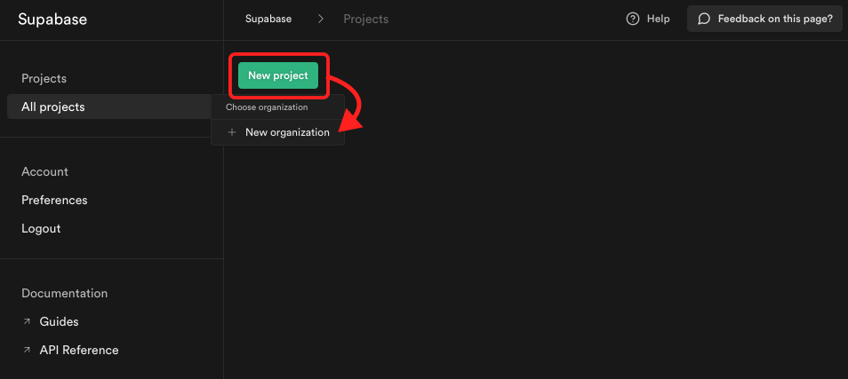
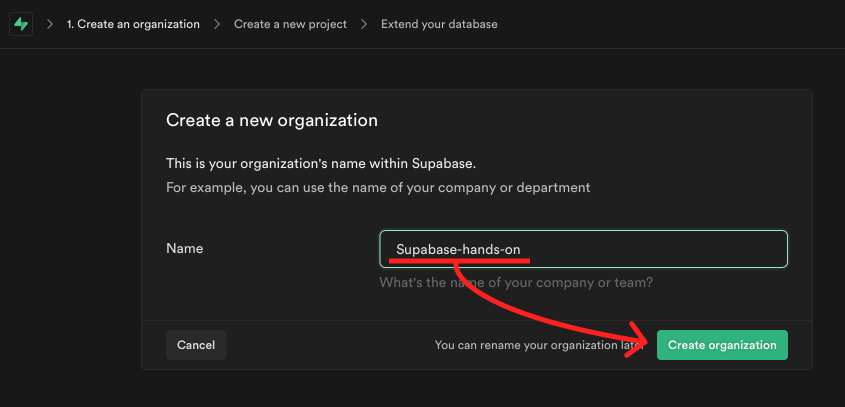
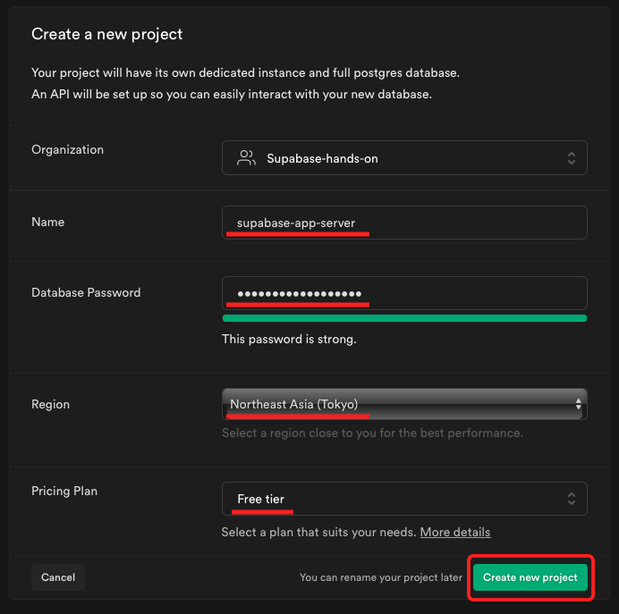
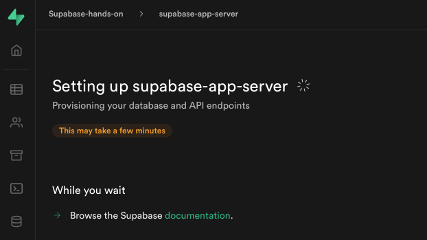
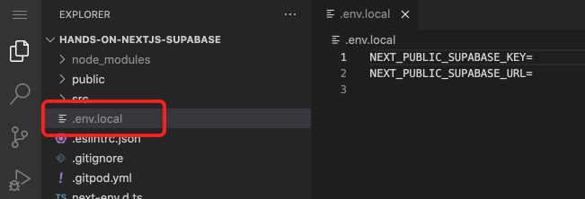
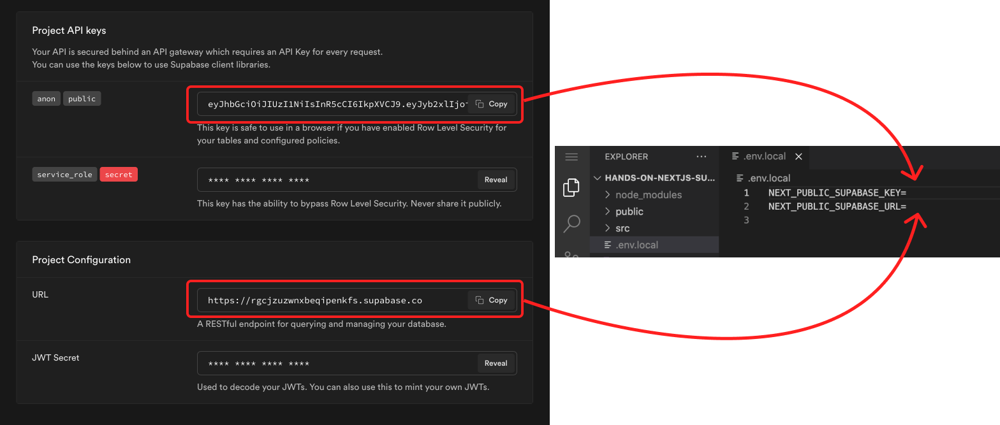
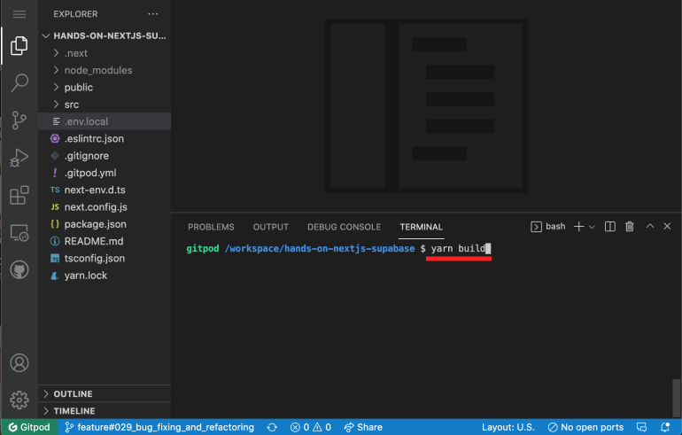
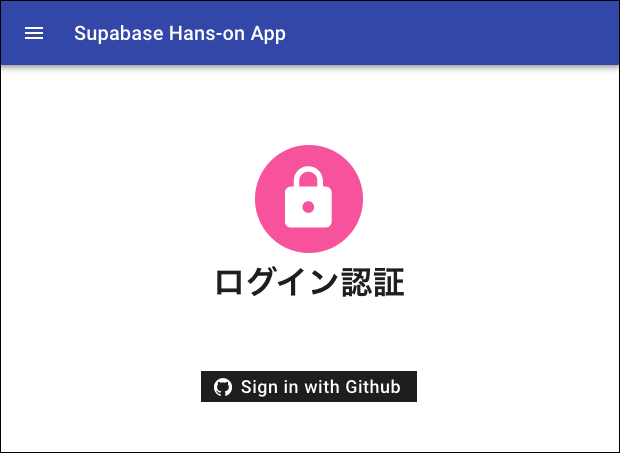

# ４．プロジェクトの作成

## ✅ Supabase のプロジェクトを作成していきます。

### ① [ New Project ] をクリック → [ New Organizations ]をクリック。



### ② Organization の名前入力 → [ Create Organization ]をクリック。

> ☝ Organization(組織)は、 プロジェクトをまとめるグループのようなものです。



### ③ プロジェクト名、DB パスワード、リージョンを選択 → 作成

| 項目              |            解説             |         値例          |
| :---------------- | :-------------------------: | :-------------------: |
| name              |     プロジェクトの名前      |  supabase-app-server  |
| Database Password | PostgreSQL の DB パスワード |       任意の値        |
| Region            |  リージョン(サーバの場所)   | Northeast Asia(Tokyo) |



☝ Database Password は、今回のハンズオンでは使用しませんが、忘れないほうが良いかも。



☝ Region は、一番距離が近い東京を選択することをオススメします。




### ④ プロジェクトの作成が開始されます。



## ✅ API キーを保存

### ① Gitpot の画面を開き、[.local.env]を開く。



### ② Supabase のページの下部に API キーと URL が表示されているので、[.local.env]に貼り付け。



以下のような感じになれば OK です。

```shell
NEXT_PUBLIC_SUPABASE_KEY=xxxxxxxxxxxxxxx.xxxxxxxxxxxxxxx.xxxxxxxxxxxxxx
NEXT_PUBLIC_SUPABASE_URL=https://xxxxxxxxxx.supabase.co
```

> ☝ この API と URL を頼りに、Next.js から Supabase へアクセスします。

### ③ yarn build → yarn start をして起動してみましょう。

ターミナルに、yarn build と入力して、エンターを押します。


Done という文字が確認できたら、 yarn start と入力してエンターを押します。  
表示された http://localhost:3000 にブラウザでアクセスしてください。


### ④ 以下のようなトップ画面が表示されれば成功です！


