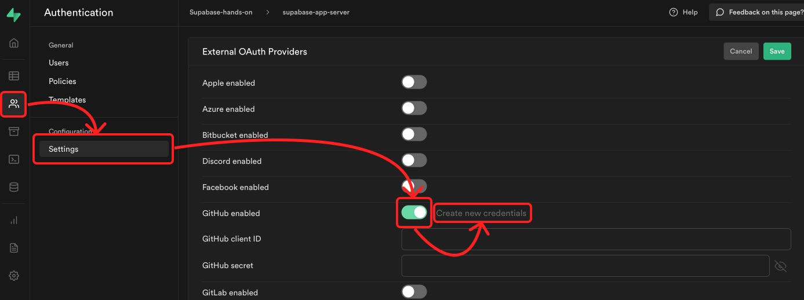
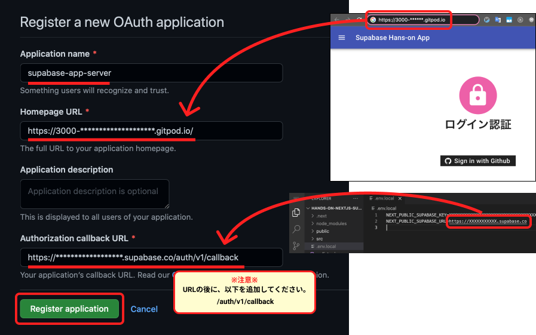
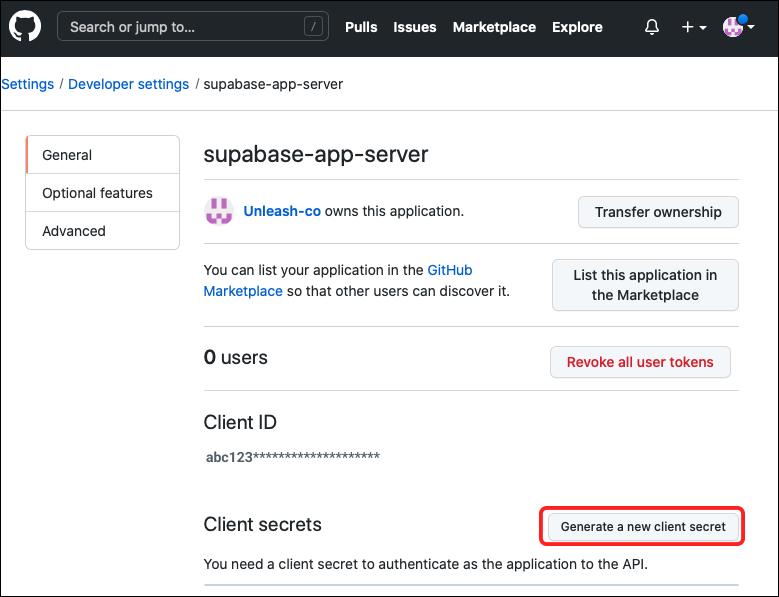
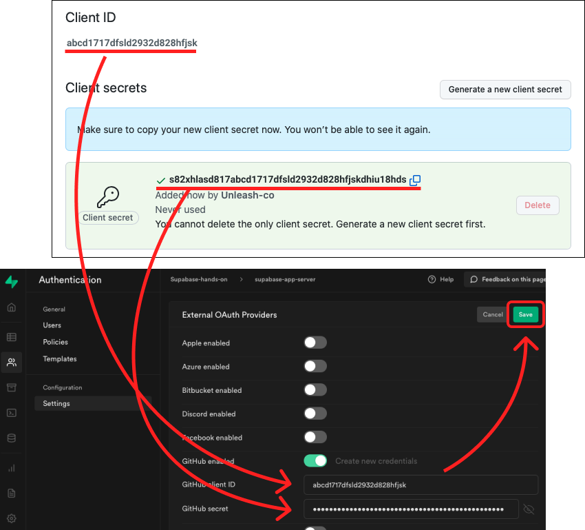
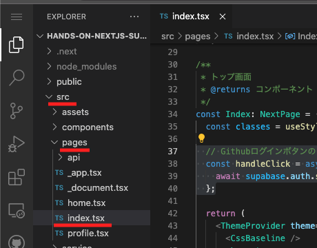
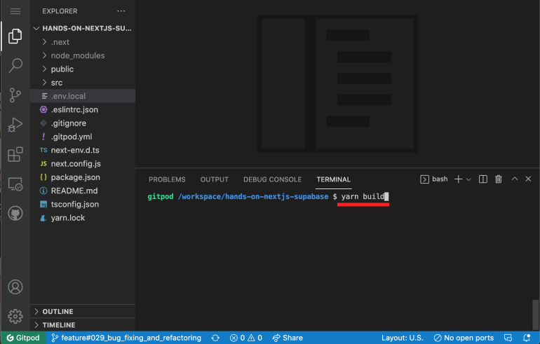
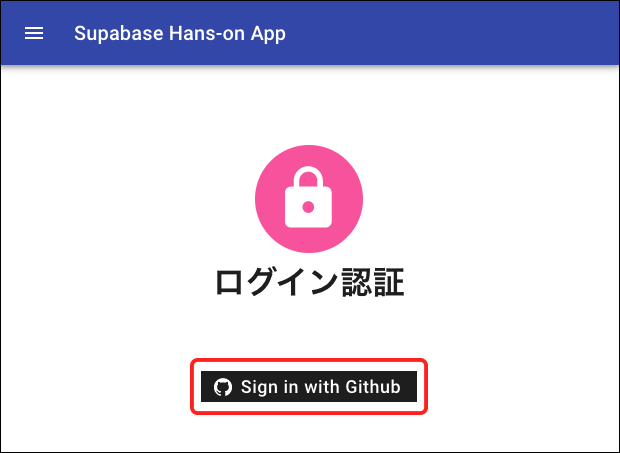
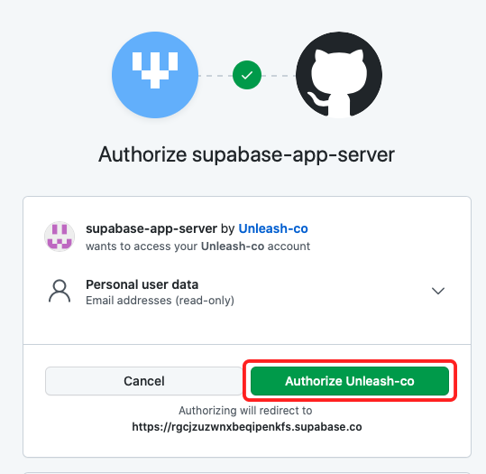

# ５．Github ログインの構築

## ✅ Supabase 側 の設定

### ① Supabase から Github を開く

1. Authentication をクリック
2. Setting
3. Github enabled をオン
4. Create new credentials をクリック



### ② 必要な３つの情報を入力 → Register application をクリック。

| No  | 項目                       | 解説                                                                                       |
| :-: | :------------------------- | :----------------------------------------------------------------------------------------- |
|  1  | Application name           | 任意                                                                                       |
|  2  | Homepage URL               | yarn dev で開いたページの URL をペースト。                                                 |
|  3  | Authorization callback URL | .env.local の NEXT_PUBLIC_SUPABASE_URL に記載した URL に、/auth/v1/callback を付けて入力。 |

☝ すべて入力できたら、Register Application をクリック。



### ③ Generate a new client secret をクリック → Github のキーを作成

☝ クリック後に、Github のパスワードを入力する場合もあります。



### ④ Client ID と Client secrets を、 Supabase に貼り付け

☝ 入力後は、Save ボタンを忘れずに！



## ✅ フロント(Next.js)の設定

Gitpod を開き、作業をしていきましょう。

### ① src → pages → index.tsx を開いてください。



### ② 21 行目にある、以下のコードのコメントを解除してください。

```javascript
const handleClick = async () => {
  // ５．Github ログインの作成 - Github ログイン処理
  await supabase.auth.signIn({ provider: "github" });
};
```

### ③ yarn build → yarn start をしてください。

ターミナルにて、一度 Ctrl + C を押して、サーバーを解除します。  
その後、yarn build と入力して、エンターを押してください。


Done という文字が確認できたら、 yarn start と入力してエンターを押します。  
表示された http://localhost:3000 にブラウザでアクセスしてください。


### ④ 保存をして、Sign in with Github をクリック



### ⑤ 認証確認画面が開きますので、Authorize ... をクリック



### ⑤ プロフィール入力画面が表示されば成功！


