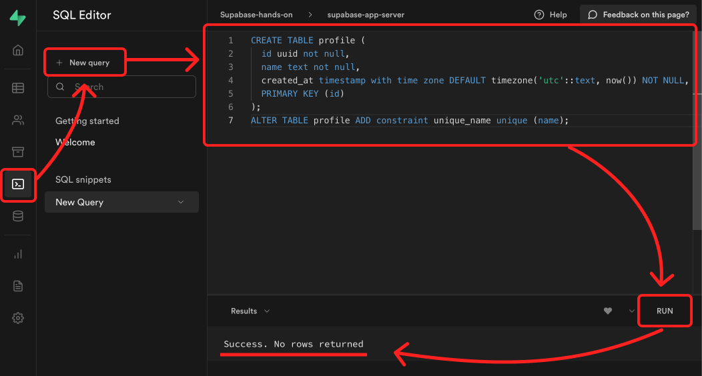
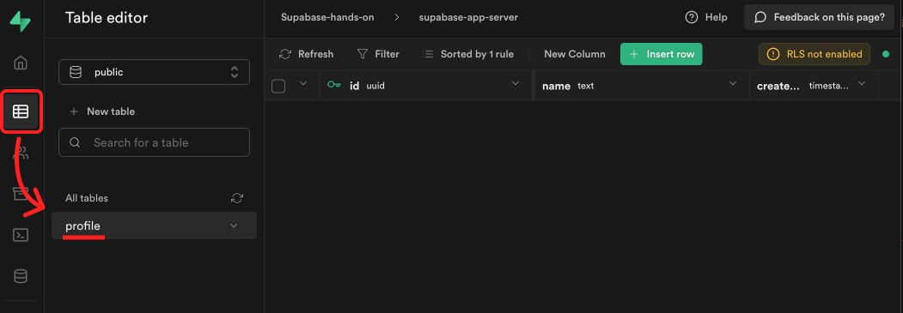
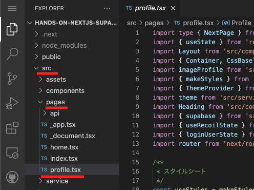
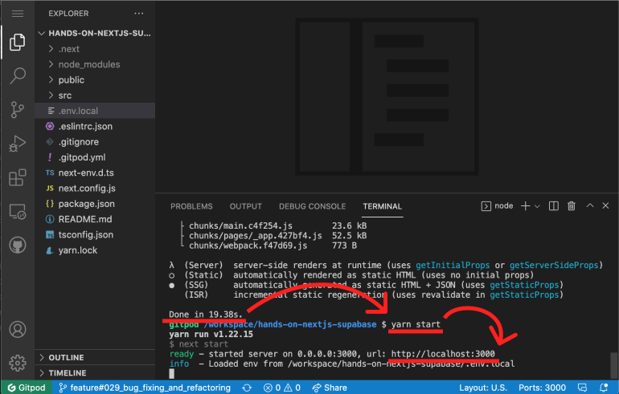
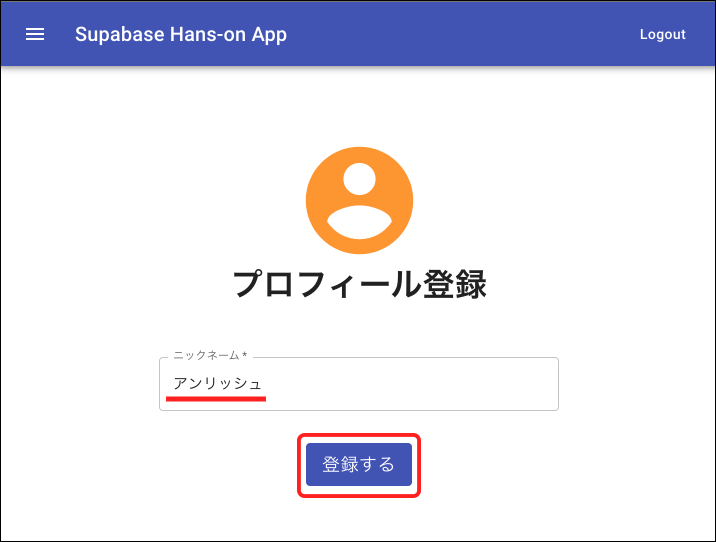
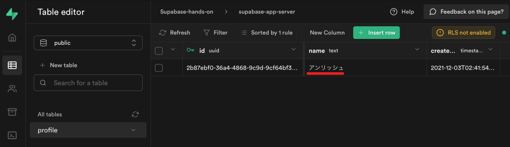

# ６．プロフィール登録

プロフィールを登録するためのテーブルを作成後、実際に登録作業をしていきます。

## ✅ Supabase に、プロフィールのテーブルを作成

### ① SQL を実行して、テーブルを作成

1. 左の SQL をクリック
2. New query をクリック
3. 右に表示されたエディタに、以下の SQL を貼り付け
4. RUN をクリック
5. Success. No rows returned と表示されていれば成功！

```sql
CREATE TABLE profile (
  id uuid not null,
  name text not null,
  created_at timestamp with time zone DEFAULT timezone('utc'::text, now()) NOT NULL,
  PRIMARY KEY (id)
);
ALTER TABLE profile ADD constraint unique_name unique (name);
```



### ② テーブルが作成されてるか確認

1. 左の Table をクリック
2. Profile テーブルができていれば成功！



## ✅ フロント(Next.js)から、プロフィールを登録する

### ① src → pages → profile.tsx を開いてください。



### ② 33〜40 行目にある、以下のコードのコメントを解除してください。

```javascript
// ６．プロフィール登録 - プロフィール登録処理
const { error } = await supabase.from("profile").upsert([
  {
    id: loginUser.id,
    name: name,
  },
]);
error && console.error(error);
router.push("/home");
```

### ③ yarn build → yarn start をしてください。

ターミナルにて、一度 Ctrl + C を押して、サーバーを解除します。  
その後、yarn build と入力して、エンターを押してください。


Done という文字が確認できたら、 yarn start と入力してエンターを押します。  
表示された http://localhost:3000 に、カーソルを合わせて「Ctrl+左クリック」を行い、ブラウザにアクセスしてください。


### ④ ページ更新後、プロフィール登録画面でニックネーム入力し、登録するをクリック



### ⑤ Supabase のテーブルにデータが登録されていれば成功！


