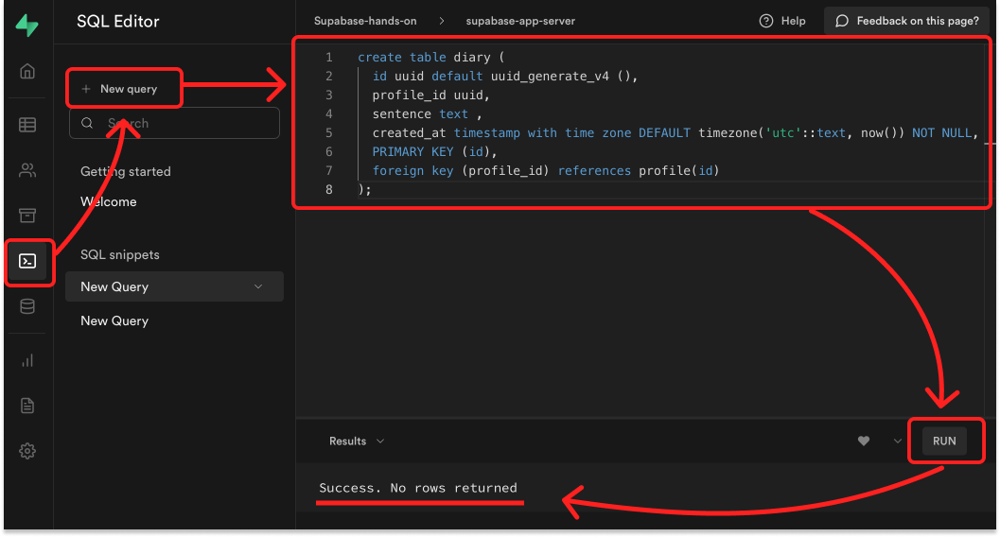
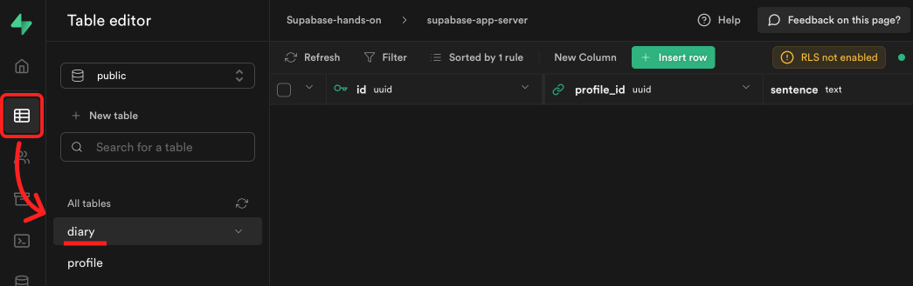
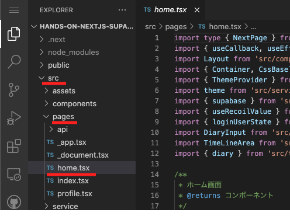
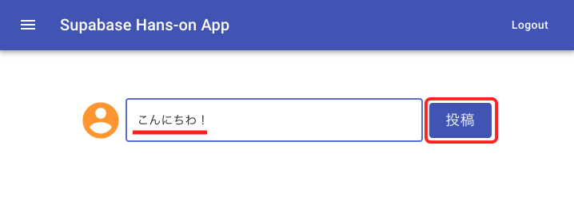
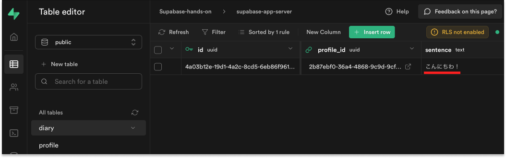
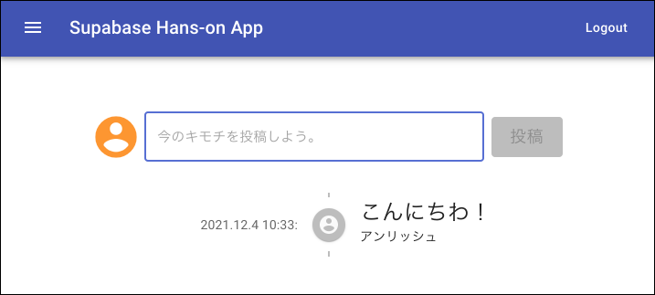

# ７．投稿ページ

プロフィールを登録するためのテーブルを作成後、実際に登録作業をしていきます。

## ✅ Supabase に、投稿用のテーブルを作成

### ① SQL を実行して、テーブルを作成

1. 左の SQL をクリック
2. New query をクリック
3. 右に表示されたエディタに、以下の SQL を貼り付け
4. RUN をクリック
5. Success. No rows returned と表示されていれば成功！

```sql
create table diary (
  id uuid default uuid_generate_v4 (),
  profile_id uuid,
  sentence text ,
  created_at timestamp with time zone DEFAULT timezone('utc'::text, now()) NOT NULL,
  PRIMARY KEY (id),
  foreign key (profile_id) references profile(id)
);
```



### ② テーブルが作成されてるか確認

1. 左の Table をクリック
2. diary テーブルができていれば成功！



## ✅ フロント(Next.js)から、投稿する。

### ① src → pages → home.tsx を開いてください。



### ② 56 行目にある、以下のコードのコメントを解除してください。

```javascript
const { error } = await supabase.from("diary").insert([
  {
    profile_id: loginUser.id,
    sentence: sentence,
  },
]);
error && console.error(error);
```

### ③ yarn build → yarn start をしてください。

### ④ ホーム画面で、適当に文字を入力後、登録するをクリック



### ⑤ Supabase の diary テーブルにデータが登録されていれば成功！



## ✅ 投稿の内容を表示する。

### ① xx 行目にある、以下のコードのコメントを解除してください。

```javascript
const { data } = await supabase
  .from("diary")
  .select(
    `sentence,
      created_at,
      profile (
        name
      )`
  )
  .order("created_at", { ascending: false });

setTimeline(data);
```

### ② yarn build → yarn start をしてください。

### ③ ホーム画面先程投稿した値が表示されます。



## 🤔 RDB(リレーショナルデータベース)の強み

profile と diary テーブルを合わせて、ニックネームと文章を表示させています。




メリット

- もしニックネームを変更した場合でも、過去の投稿に表示されるニックネームも一緒に更新されます。
- 項目を追加も簡潔にでき、必要な項目が把握しやすい。


