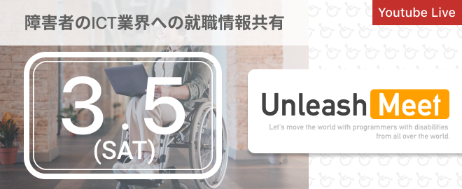

# おわりに

## お疲れさまでした！

今回のハンズオンのすべての工程が終了しました。

冒頭にも申しましたが、Supabase が最強！と伝えたいわけではありません。

Firebase だけではない選択肢があるということを知っていたれたのではと思います。皆さんの日常のお仕事に、少しでもお役に立ててれば嬉しいです。

今回のハンズオンにて、ご質問や気がついた点等あれば、ご気軽にご連絡いただけると幸いです

## 宣伝

### 😄 フリーランスエンジニアしています！

[Unleash - アンリッシュ -](https://www.unleash.site/)

[Akio Yano - Twitter](https://twitter.com/AkiUnleash)

※ 大変有り難いことに、現在は案件受け付けておりません。



１６年間 Excel VBA で仕事をしてきました。
独学後、Web アプリケーション開発もしています。
得意言語は Next.js(React)+Typescript です。



### 💻 ErrorShare システム開発のエラーを共有する Web サービス

https://errorshare.dev/



システム開発時のエラーに特化した、技術共有サービスです。
2021 年 12 月末にリリースしました。
今後も色々な機能追加をしていく予定です！



### ♿ UnleashMeet

[【オンライン】UnleashMeet ~ 障害者の ICT 業界への就職情報共有 - connpass](https://unleash-meet.connpass.com/event/237356/)



「 世界中の『 障がい者プログラマー 』が、DX を進める社会を目指す。 」というコンセプト元に、障がいがある方がプログラマとしてお仕事をするためにはどうすればよいか？意見交換をするためのコミュニティ。



## この度はご受講いただき有難うございました。

受講者の皆様、この度はお時間をいただき有難うございました。

MarkingCloud のスタッフの皆様、資料作成方法等も含めてたくさんのアドバイスを惜しみなくいただきました。
この場を借りて、お礼を申し上げます。

有難うございました！
